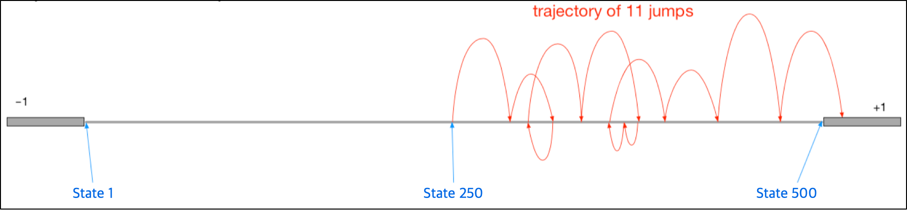

## Semi-gradient TD(0) with a Neural Network

w you will implement **semi-gradient TD with a simple Neural Network** and use it for the same policy evaluation problem.

We will implement **semi-gradient TD with a simple Neural Network** and use it for the policy evaluation problem on the 500 state random walk environment.

Assignment 2. In this assignment we will:

- Implement stochastic gradient descent method for state-value prediction.
- Implement semi-gradient TD with a neural network as the function approximator and Adam algorithm.
- Compare performance of semi-gradient TD with a neural network and semi-gradient TD with tile-coding.

## Pseudocode

Pseudocode from Sutton & Barto Reinforcement Learning an Introduction page 203.

## Environment

We will implement and use a smaller 500 state version of the problem we covered in lecture (see "State Aggregation with Monte Carlo”, and Example 9.1 in [Sutton & Barto Reinforcement Learning an Introduction](http://www.incompleteideas.net/book/RLbook2018.pdf#page=225)). The diagram below illustrates the problem.

There are 500 states numbered from 1 to 500, left to right, and all episodes begin with the agent located at the center, in state 250. For simplicity, we will consider state 0 and state 501 as the left and right terminal states respectively.

The episode terminates when the agent reaches the terminal state (state 0) on the left with -1 reward, or the terminal state (state 501) on the right with +1 reward.