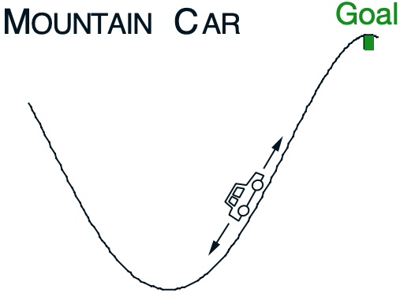

# Function Approximation and Control

Assignment 3. In this assignment we will:

- Use function approximation in the control setting
- Implement the Sarsa algorithm using tile coding
- Compare three settings for tile coding to see their effect on our agent

## Control Task

As the control task for this assignment we will use the Mountain Car Task introduced in [Section 10.1 of the textbook](http://www.incompleteideas.net/book/RLbook2018.pdf#page=267)

The car is under-powered so the agent needs to learn to rock back and forth to get enough momentum to reach the goal. At each time step the agent receives from the environment its current velocity (a float between -0.07 and 0.07), and it's current position (a float between -1.2 and 0.5). Because our state is continuous there are a potentially infinite number of states that our agent could be in. We need a function approximation method to help the agent deal with this. In this assignment we will use tile coding.